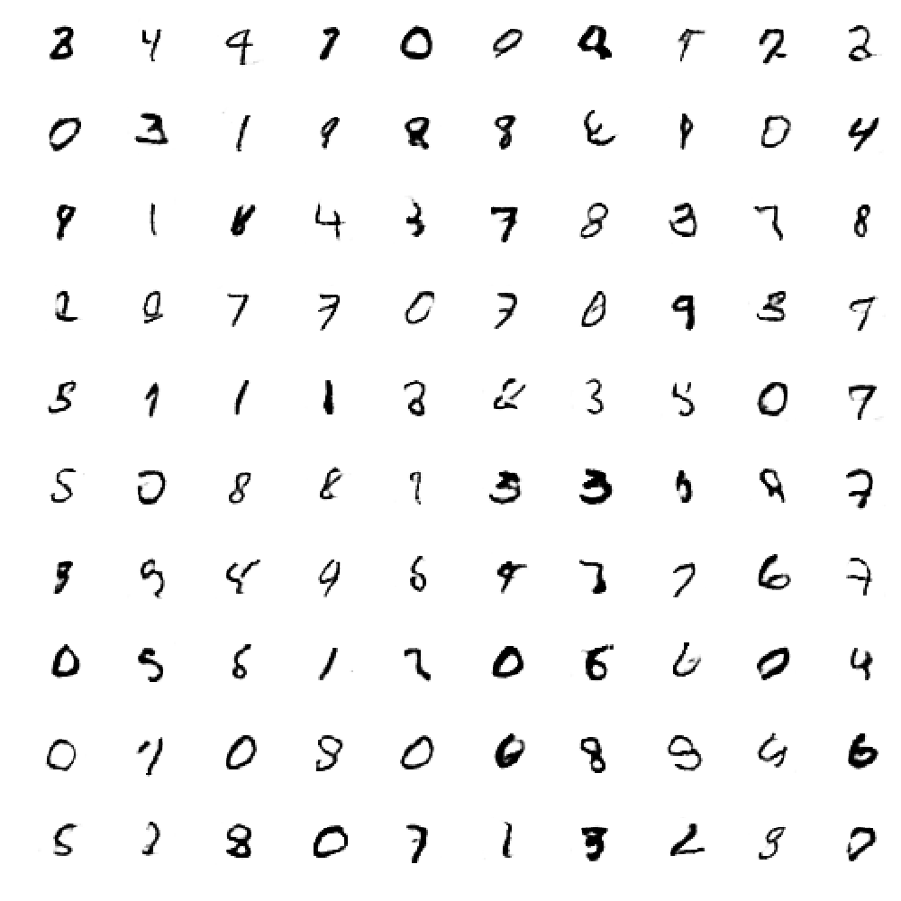

# GAN-for-MNIST
A simple GAN for the MNIST dataset using Keras.

Simple and straightforward Generative Adverserial Network (GAN) implementations using the [Keras](https://keras.io/ "Keras") library.  
Several of the tricks from [ganhacks](https://github.com/soumith/ganhacks) have already been implemented.

`GAN.py`: a standard GAN using fully connected layers.


## DCGAN

  
[Generated MNIST images at epoch 50.]

  
[Loss at every epoch for 50 epochs.]


## Requirements 
  1. Keras 
  2. MNIST Dataset 

## Installation 
  1. Clone this repo 
  2. Run 
  ```
  GAN.py
  ```
